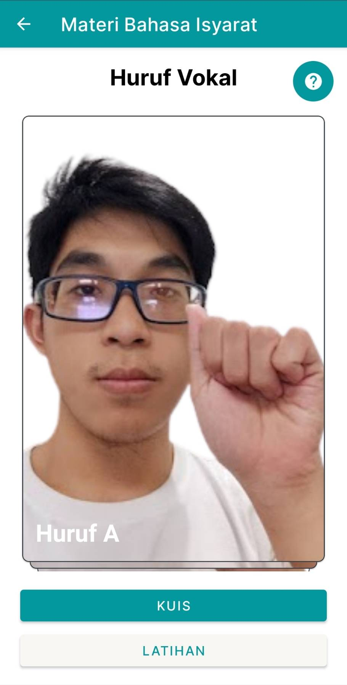
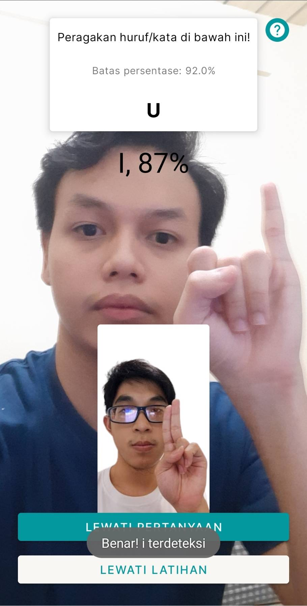
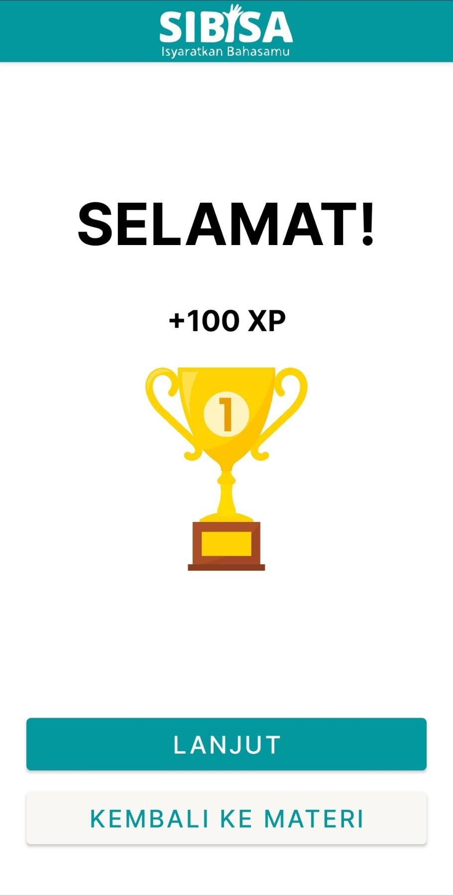
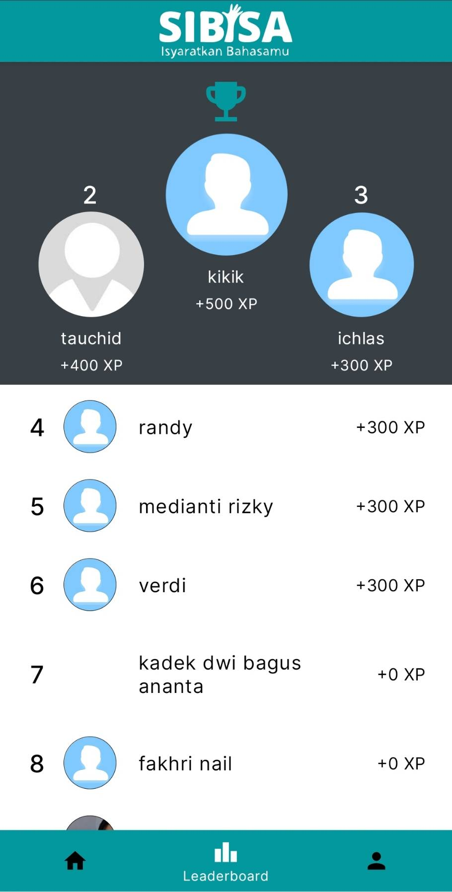
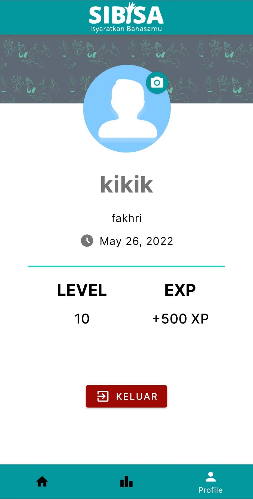

# Project Name
> SIBISA - A sign language learning app coupled with gamification concept and powered with ML and cloud technologies

## Table of contents
* [General info](#general-info)
* [Screenshots](#screenshots)
* [Technologies and Libraries](#technologies-and-libraries)
* [Setup](#setup)
* [Features](#features)
* [Authors](#authors)

## General info
SIBISA is an Indonesian sign language (SIBI) learning app. SIBISA is inspired by Duolingo, and its goal is to popularize learning sign language to help accomodate the deaf community in day-to-day life for a more inclusive society and environment.

## Screenshots

## Technologies and Libraries
* Material Design
* Retrofit
* Glide
* GSON
* TFLite
* CameraX
* [CircleImageView by hdodenhof](https://github.com/hdodenhof/CircleImageView)
* [CardStackView by yuyakaido](https://github.com/yuyakaido/CardStackView)

## Setup
### Development
Clone this repository, open it in Android Studio and run the project
### App
Get the APK in the apk folder and install it in your phone, have fun with the app!

## Features
* Login and register
* Lesson to learn examples of sign language
* Exercise to accompany you exercise your new language with a reference picture
* Quiz to test your knowledge and get rewards afterwards!
* Leaderboard to compare your progress with everyone using the app, get your number 1 rank!
* Profile to show your identity

## Authors
* Fakhri Nail Wibowo - A2002F0093 - Institut Teknologi Bandung
* Verydian Triwidodo - A2387F2942 - Universitas Nasional